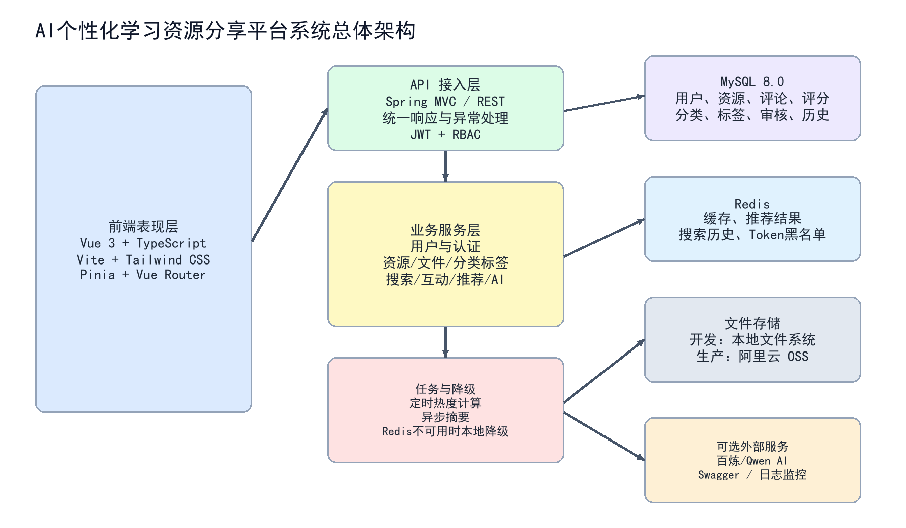
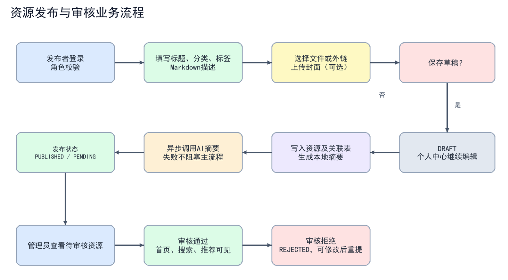
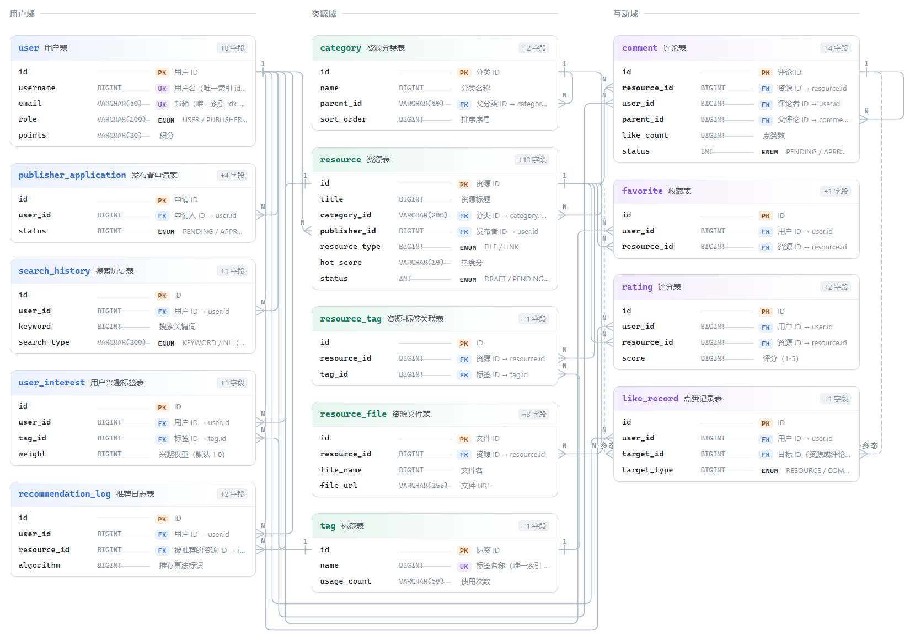

# 项目需求分析

> **项目**：AI个性化学习资源分享平台

## 1. 项目概述

### 1.1 项目背景、目的和意义

#### 1.1.1 项目背景

在高校学习场景中，课程笔记、实验资料、编程教程、考试复习材料和公开课链接通常分散在网盘、群聊、浏览器收藏夹以及个人设备中。资源数量不断增加，但资源的标题、分类、质量和内容结构并不统一，学习者很难快速判断资料是否适合当前课程和能力阶段。传统文件夹式管理只能解决“存放”问题，不能解决“发现、理解、评价和持续复用”问题。

本项目拟建设一个面向大学生的 AI 个性化学习资源分享平台，把资源发布、分类标签、关键词搜索、自然语言搜索、社区互动和智能推荐整合到同一套前后端分离系统中。项目计划以仓库为统一载体，按本档条目逐步产出需求原型、数据库脚本、前后端源码和测试资产，支撑课程设计阶段的开发、演示与验收。

#### 1.1.2 项目目的

- 建立统一的学习资源目录，让用户能够按关键词、分类、标签、评分和热度检索资料。
- 利用 AI 生成摘要、解析自然语言搜索意图并生成推荐理由，降低用户预览和筛选成本。
- 通过发布者申请、资源状态和管理员审核机制，形成从贡献资源到质量治理的闭环。
- 为 Redis、AI 服务和对象存储设计本地降级路径，保证外部依赖不可用时，核心浏览、搜索和互动功能仍可运行。

#### 1.1.3 项目意义

对学习者而言，平台把分散资料转化为可检索、可评价、可收藏的学习资产；对资源贡献者而言，平台提供发布、反馈和个人影响力积累渠道；对课程实践而言，项目覆盖 Vue、Spring Boot、MySQL、Redis、JWT、REST API、文件存储和 AI 接入等完整工程链路。

### 1.2 项目现状

同类产品通常具备文件上传或文章发布能力，但在课程学习场景中仍存在四类不足：一是资源来源分散，缺少统一标签和分类；二是搜索主要依赖精确关键词，用户无法用“适合期末复习的 Java 并发资料”这类自然语言表达需求；三是文件缺乏摘要和质量反馈，用户需要逐个打开才能判断；四是推荐往往只按热度排序，不能结合用户的点赞、收藏和评分行为。

本项目在 V1 中集中资源，优先打通资源社区的主链路，并预先划清本期范围与后续迭代的边界。按本档规划，V1 计划交付 14 张核心业务表及配套的建库脚本与种子数据脚本、前后端应用代码、静态页面原型和自动化测试脚本；全文检索中文分词、内容安全扫描、登录限流和生产级观测等不列入本期，作为后续迭代任务处理。

### 1.3 项目要解决的问题及拟采用的方法

#### 1.3.1 项目要解决的问题

| 问题 | 具体表现 | 系统解决方案 |
|---|---|---|
| 资源难找 | 资料分散、命名不统一、筛选条件有限 | 分类树、标签、关键词/NL搜索、排序和分页 |
| 预览成本高 | 用户需要打开多个文件才知道内容是否相关 | 本地摘要优先，异步尝试 AI 摘要，详情页展示摘要 |
| 质量难判断 | 缺少评分、点赞、评论和审核 | 管理员审核、评分、互动计数和评论反馈 |
| 推荐不个性化 | 只展示热门内容，无法利用用户行为 | 标签权重 + 协同过滤的混合推荐，并返回解释理由 |
| 外部依赖不稳定 | Redis、AI、OSS 暂时不可用会影响演示 | 本地缓存/摘要/文件存储降级，核心链路不依赖 AI |

#### 1.3.2 拟采用的技术架构与技术选型

| 层次 | 技术选型 | 选择理由 |
|---|---|---|
| 前端 | Vue 3、TypeScript、Vite、Tailwind CSS、Pinia | 组件化开发、类型约束、快速构建和响应式页面实现 |
| 后端 | Spring Boot 3、Java 17、MyBatis-Plus | 生态成熟，适合 REST API、事务和分层业务开发 |
| 安全 | Spring Security、JWT、BCrypt | 无状态认证、角色权限控制和密码安全存储 |
| 数据 | MySQL 8.0、Redis 6+ | 关系数据持久化与缓存、历史、黑名单能力 |
| AI与存储 | 百炼/Qwen OpenAI兼容接口、OSS/本地文件 | 摘要、NL 搜索、推荐理由及可切换文件存储 |

### 1.4 项目分工

| 角色 | 主要工作 | 计划交付物 |
|---|---|---|
| 产品与需求 | 梳理用户画像、用例、验收标准和迭代范围 | PRD、需求分析、演示脚本 |
| 后端与安全 | Spring Boot、认证、RBAC、资源和管理 API | 后端源码、接口说明、配置 |
| 前端与交互 | 页面原型、Vue 路由、状态管理、互动组件 | 前端源码、原型页面 |
| 数据库与 AI | 表结构、索引、摘要、NL 搜索、推荐策略 | 数据库脚本、AI 服务与算法说明 |
| 测试与文档 | 接口测试、异常验证、部署记录和文档整理 | 测试资产、交付清单、需求分析文档 |

### 1.5 项目进度安排

| 阶段 | 主要任务 | 阶段验收标准 |
|---|---|---|
| Phase 1 基础设施 | 前后端脚手架、数据库、统一响应、CORS、Swagger | 项目可编译，MySQL 初始化成功 |
| Phase 2 认证与 RBAC | 注册登录、JWT、刷新、角色守卫、个人资料 | USER/PUBLISHER/ADMIN 权限链路可演示 |
| Phase 3 资源管理 | 资源 CRUD、草稿、文件/外链、分类标签、OSS/本地存储 | 发布、编辑、删除、详情可用 |
| Phase 4 搜索与互动 | 关键词/NL 搜索、历史、点赞、收藏、评分、评论 | 组合筛选和互动状态正确 |
| Phase 5 AI 与推荐 | 摘要、推荐、理由、流式聊天及降级 | 无 AI Key 也能完成核心演示 |
| Phase 6 管理后台 | 用户、资源、发布者申请审核和统计 | 管理员可闭环治理内容 |
| Phase 7 测试与交付 | 测试脚本、安全检查、文档、演示准备 | README、PRD、设计和交付物一致 |

### 1.6 项目实施已具备的条件

#### 1.6.1 技术知识储备

项目需要掌握 Java 17 与 Spring Boot 分层开发、MyBatis-Plus 数据访问、Vue 3 与 TypeScript 组件开发、MySQL 表结构与索引设计、Redis 缓存、JWT 认证、REST API、Markdown 渲染、HTTP 文件上传以及 AI API 调用。对前端而言，还需要理解路由守卫、Axios 拦截器、状态管理和响应式断点；对后端而言，需要理解事务、异常统一处理、权限注解和异步任务。

#### 1.6.2 开发工具与环境的安装、部署情况

- JDK 17.0.14、Maven 3.9.11、Node.js 22.20.0、npm 10.9.3 已具备。
- MySQL 8.0 作为主数据库；在 Windows 下已具备。
- Redis 计划以 Docker 方式部署，应用通过 REDIS_HOST、REDIS_PORT 等环境变量连接；连接不可用时需支持降级，不影响普通资源链路。
- AI Key 与对象存储配置均为可选项：未配置时应能依靠本地摘要和本地文件存储完成全流程演示。

#### 1.6.3 相关案例查阅情况

立项准备阶段已查阅 Spring Boot 官方参考、Spring Security 官方参考、Vue Router 文档、MySQL 与 Redis 官方手册以及阿里云 Model Studio 文档，重点核对无状态认证过滤器、分页查询、缓存降级和 OpenAI 兼容接口的约定，作为技术选型与需求条目的依据。

### 1.7 项目预算

| 项目 | 开发阶段预算 | 生产/增强阶段预算 | 说明 |
|---|---|---|---|
| 软件与开发工具 | 0 元 | 0 元 | JDK、Maven、Node.js、IDE 可使用现有环境 |
| MySQL/Redis | 0 元 | 视云主机配置 | 本地 MySQL；Redis 使用 Docker 或云服务 |
| AI 服务 | 0 元或按量 | 按百炼调用量 | 无 Key 时使用本地降级逻辑 |
| 文件存储 | 0 元 | 按 OSS 容量与流量 | 开发环境使用本地存储 |
| 服务器与域名 | 0 元 | 按部署方案 | 课程演示可使用 localhost |

### 1.8 预期开发过程中可能遇到的困难及预防措施

| 风险 | 影响 | 预防与处理 |
|---|---|---|
| Redis/Docker 连接失败 | 缓存、黑名单不可用 | 启动前检查容器状态；缓存读写统一捕获异常，核心查询回落到数据库 |
| AI Key 失效或额度不足 | 摘要、NL、推荐理由失败 | 本地规则和本地摘要兜底；聊天失败返回明确错误提示 |
| 文件上传安全问题 | 路径穿越、恶意文件或孤儿文件 | 随机存储名、大小/MIME 校验、生产启用 OSS 私有读和扫描 |
| 权限越权 | 普通用户修改他人资源 | URL 级白名单、方法级角色注解与业务层所有权校验三层拦截，并补充 401/403 用例 |
| Markdown/XSS | 恶意脚本影响浏览器 | 限制 HTML/协议，前端按不可信文本处理 AI 输出 |
| 查询性能与 N+1 | 列表响应变慢 | 索引、分页、批量查询、缓存热点数据并用压测数据验证 |

### 1.9 参考文献

- [1] Spring Boot Reference Documentation. https://docs.spring.io/spring-boot/docs/3.2.5/reference/html/（访问日期：2026-09-20）
- [2] Spring Security Reference. https://docs.spring.io/spring-security/reference/（访问日期：2026-09-20）
- [3] Vue Router Official Documentation. https://router.vuejs.org/（访问日期：2026-09-20）
- [4] MySQL 8.0 Reference Manual. https://dev.mysql.com/doc/refman/8.0/en/（访问日期：2026-09-20）
- [5] Redis Documentation. https://redis.io/docs/latest/（访问日期：2026-09-20）
- [6] 阿里云 Model Studio / 百炼文档. https://help.aliyun.com/zh/model-studio/（访问日期：2026-09-20）
- [7] Spring AI Reference. https://docs.spring.io/spring-ai/reference/（访问日期：2026-09-20）

## 2. 系统需求分析

### 2.1 系统总体架构

系统拟采用前后端分离架构。前端承担页面呈现、路由守卫、交互状态与 Markdown 渲染；后端通过 REST API 提供认证、资源、搜索、互动、推荐和管理能力；MySQL 保存核心业务数据，Redis 承担缓存、搜索历史和 Token 黑名单；文件存储按配置在本地磁盘与阿里云 OSS 之间切换；百炼/Qwen 通过 OpenAI 兼容接口提供可选 AI 能力。

*图 1 系统总体架构图*

端口与初始化约定：前端开发服务器使用 5173 端口，后端服务使用 8080 端口，数据库命名为 learning_platform。数据库初始化分两步执行，先建库建表，再导入基础分类、标签和管理员账号等种子数据。生产环境必须通过环境变量注入数据库密码、JWT_SECRET、AI_API_KEY 和 OSS 密钥，禁止使用任何默认测试凭据。

### 2.2 用户角色与权限需求

| 角色 | 主要目标 | 核心权限 | 限制 |
|---|---|---|---|
| 未登录访客 | 浏览并发现资料 | 查看已发布资源、分类、标签、公开评论 | 不能点赞、收藏、评分、评论和发布 |
| USER 学习者 | 学习、收藏和反馈 | 搜索、互动、AI 推荐、申请发布者 | 不能直接发布资源和访问管理接口 |
| PUBLISHER 发布者 | 贡献和维护资料 | 创建/编辑/删除自己的资源、保存草稿 | 不能管理他人资源和平台用户 |
| ADMIN 管理员 | 内容治理和平台运营 | 用户角色、资源审核、申请审核、统计 | 高风险操作应审计留痕 |

权限控制拟采用三层策略：第一层做 URL 级的公开/受保护规则划分，第二层做角色级访问控制，第三层在业务层校验资源所有权。任何对外返回用户信息的接口都必须剔除密码散列字段；认证失败统一返回 401，越权访问统一返回 403。

### 2.3 功能需求

| 编号 | 功能模块 | 详细需求 | 验收标准 |
|---|---|---|---|
| AUTH-01 | 注册登录 | 用户名、邮箱、密码校验；BCrypt 存储；登录签发 access/refresh token | 注册成功返回 201；登录返回用户、角色与令牌；任何响应都不包含密码 |
| RES-01 | 资源管理 | 支持文件与外部链接两种类型、Markdown 描述、标签、封面图、资源文件与草稿 | 发布者可创建、编辑、删除自己的资源 |
| SEARCH-01 | 搜索发现 | 关键词、分类/子分类、标签、评分、排序、分页、搜索历史与热门搜索 | 组合筛选生效，空结果可降级放宽，分页字段正确 |
| AI-01 | AI 能力 | 智能摘要、自然语言搜索意图解析、推荐理由生成、流式聊天与悬浮助手 | AI 失败不阻塞核心链路，聊天失败给出明确错误提示 |
| SOCIAL-01 | 社区互动 | 资源与评论点赞、收藏、1-5 星评分、一级评论与回复、评论删除、详情页分享链接复制 | 幂等切换，计数与平均分同步更新，并能回显当前用户的互动状态 |
| ADMIN-01 | 后台治理 | 用户角色与状态管理、资源审核、发布者申请审批、分类与标签维护、平台统计仪表盘 | 仅 ADMIN 可访问；待处理项可查询，状态变更后闭环正确 |
| USER-01 | 个人中心 | 个人资料编辑、头像上传（JPG/PNG/GIF/WEBP）、我的收藏、我的发布、我的草稿箱、个人学习统计 | 仅本人可读写自己的资料与列表；头像上传成功后能正确回显 |
| PUB-01 | 发布者申请 | USER 提交发布者申请并填写申请说明，ADMIN 审批通过或驳回；通过后角色升级为 PUBLISHER | 申请状态在 PENDING/APPROVED/REJECTED 间流转正确；角色仅在审批通过后变更 |
| TAX-01 | 分类与标签 | 两级分类树查询与维护、标签字典、热门标签、标签搜索自动补全 | 分类父子层级正确；标签按使用热度排序返回 |
| HOT-01 | 热度与榜单 | 综合浏览、点赞、收藏、评分为资源计算热度分并定时刷新，提供热门榜与最新榜 | 热度分随互动变化；榜单分页与排序结果稳定 |
| STOR-01 | 文件与封面 | 资源文件与封面图上传，支持本地磁盘与 OSS 双存储切换，单文件上限 500MB | 上传后返回可访问地址；切换存储方式无需改动业务代码 |
| CHAT-01 | AI 悬浮助手 | 全局悬浮聊天入口，可拖动，携带当前页面上下文提问，流式输出并支持失败重试 | 各页面均可唤起；上下文随路由变化；失败有明确提示与重试入口 |
| UX-01 | 前端交互规范 | 统一 Toast 提示、通用模态弹窗、路由守卫（登录/发布者/管理员）与筛选分页联动 | 越权访问被路由守卫拦截；关键操作均有明确反馈 |
| DATA-01 | 缓存与降级 | Redis 承担 AI 应答、推荐结果、搜索历史与 Token 黑名单缓存，连接失败时优雅降级 | 断开 Redis 后核心浏览、搜索与互动链路仍可用 |

### 2.4 关键业务流程

#### 2.4.1 注册、认证与资源发布

用户注册后默认为 USER；USER 可提交发布者申请，经管理员审核通过后升级为 PUBLISHER。发布者填写标题、分类、标签和 Markdown 描述，选择上传文件或填写外链，保存草稿或直接提交发布。资源写入时先生成本地摘要，再由后台异步尝试 AI 摘要；即使 AI 超时、额度不足或未配置密钥，资源也应能正常保存。

*图 2 资源发布与审核流程图*

#### 2.4.2 搜索与推荐

关键词搜索按筛选条件直接构造数据库查询；自然语言搜索先由本地规则提取关键词、分类、标签、排序、数量和最低评分，必要时再请求 AI 返回结构化 JSON，AI 不得直接生成 SQL。推荐策略拟以收藏 5 分、点赞 3 分累加标签兴趣，融合标签候选与协同过滤候选，两者按 0.6 / 0.4 加权合并，过滤用户已互动的资源和未发布资源，候选为空时回落到热门资源。

#### 2.4.3 社区互动

资源详情页提供点赞、收藏、评分、评论与回复。点赞和收藏通过唯一约束实现幂等切换；评分按“每用户每资源一条记录”设计，重复提交覆盖原评分；评论支持一级评论与回复两级结构；评论状态字段预留，为后续敏感词审核留出扩展位。

### 2.5 数据库需求与设计

拟建库名为 learning_platform，字符集使用 utf8mb4。核心表围绕 user、resource 和 interaction 三条主线展开，计划共 14 张业务表：user、category、tag、resource、resource_tag、resource_file、comment、like_record、favorite、rating、search_history、user_interest、recommendation_log、publisher_application。资源和用户相关查询设置组合索引；互动表设置唯一约束，避免重复点赞、收藏和评分。

*图 3 核心数据库实体关系图*

| 表名 | 用途 | 关键字段/约束 |
|---|---|---|
| user | 用户、角色和账号状态 | username/email 唯一；role、status、password_hash |
| resource | 资源主表 | user_id、category_id、status、hot_score、rating |
| category/tag | 分类树和标签字典 | category.parent_id；tag.name/use_count |
| resource_tag | 资源与标签多对多关系 | (resource_id, tag_id) 唯一 |
| resource_file | 资源文件或封面地址 | file_url、file_size、file_type |
| comment | 一级评论和回复 | parent_id、content、status、like_count |
| like_record/favorite/rating | 互动记录 | 用户+目标唯一；评分 1-5 |
| search_history | 用户搜索历史 | user_id、keyword、search_type、created_at |
| user_interest/recommendation_log | 推荐兴趣与曝光记录 | 标签权重、算法、推荐理由 |
| publisher_application | 发布者申请审批 | PENDING/APPROVED/REJECTED |

完整字段字典与索引定义将在数据库设计阶段随建库脚本交付，初始化数据随种子数据脚本交付，两者均需与本节表格保持一致。关联关系校验放在业务层实现，不依赖显式外键；全文检索中文 ngram 分词、N+1 批量优化和内容安全扫描不列入本期范围，作为后续增强任务。

### 2.6 API 接口需求

接口统一挂载在 /api/v1 前缀下，开发环境基地址为 http://localhost:8080/api/v1；统一响应结构为 { code, message, data }，分页结构为 { records, total, page, size, pages }。认证接口统一使用 Authorization: Bearer <accessToken> 请求头，请求与响应均以 UTF-8 编码。

| 分组 | 代表接口 | 认证 | 说明 |
|---|---|---|---|
| 认证 | POST /auth/register、/login、/refresh、/logout；GET /auth/me | 部分公开 | 注册、登录、刷新、退出和当前用户 |
| 资源 | GET/POST /resources；GET/PUT/DELETE /resources/{id} | 写操作需 PUBLISHER/ADMIN | 资源 CRUD、详情、草稿、文件/外链 |
| 搜索 | GET /search；POST /search/nl；/history | NL 前端要求登录 | 关键词、自然语言、历史、热门搜索 |
| AI | POST /ai/summary；GET /ai/recommendations；POST /ai/chat/stream | 推荐需登录 | 摘要、推荐、推荐理由和流式聊天 |
| 互动 | /resources/{id}/like、/favorite、/rating、/comments | 互动需登录 | 点赞、收藏、评分、评论、回复 |
| 管理 | /admin/users、/resources、/publisher-applications、/statistics | ADMIN | 审核、角色、统计和治理 |

资源创建与更新采用 multipart 请求：data 字段承载 JSON 元数据，files[] 承载资源文件，coverImage 承载封面图。资源状态拟定为 DRAFT（草稿）、PENDING（待审核）、PUBLISHED（已发布）、REJECTED（已驳回）四种；资源详情需返回发布者、分类、标签、摘要、互动统计、文件或外链以及评论。

### 2.7 AI、缓存与降级需求

| 能力 | 输入与输出 | 缓存/超时 | 失败行为 |
|---|---|---|---|
| AI 摘要 | 标题+描述 → 约100字摘要 | 按内容哈希缓存 24h | 以本地摘要兜底，不阻塞资源写入 |
| NL 搜索 | 自然语言 → 结构化 parsedIntent | 缓存 1h | 本地规则解析并逐级放宽条件 |
| 推荐理由 | 用户兴趣+资源摘要 → 理由 | 缓存 6h；推荐结果 30min | 使用本地可解释理由 |
| 流式聊天 | 页面路由/标题+问题 → text/plain 流 | 按配置重试与超时 | 返回明确失败文本和重试入口 |
| Redis | 缓存、历史、黑名单 | 连接失败捕获并记录 WARN | 核心资源查询回退 MySQL/本地逻辑 |

### 2.8 非功能、安全与部署需求

- 性能：普通列表和详情接口本地环境目标 P95 小于 500ms（不含 AI）；AI 接口设置连接、读取和聊天超时。
- 安全：密码使用 BCrypt；JWT_SECRET、数据库密码、AI Key、OSS 密钥通过环境变量注入；生产启用 HTTPS。
- 文件：限制大小、MIME 和扩展名，随机生成存储名，禁止路径穿越；生产使用 OSS 私有读或签名 URL。
- 内容：Markdown 需要 XSS 防护，外链限制协议，AI 输出视为不可信文本，不直接作为 HTML 执行。
- 可观测性：业务异常统一转换为标准响应结构，AI 与 Redis 调用记录耗时和失败原因，不记录密码、密钥和完整敏感内容。
- 部署：开发环境为 Windows + MySQL + Docker Redis + Spring Boot + Vite；生产可将前端部署到静态站点、后端部署到 Java 容器并接入 OSS。

### 2.9 测试与验收需求

| 测试类别 | 主要用例 | 通过条件 |
|---|---|---|
| 认证与权限 | 注册、重复账号、登录、token 刷新、401/403 | 状态码和统一错误结构正确；越权被拒绝 |
| 资源链路 | 创建文件/链接、草稿、编辑、删除、详情 | 资源状态、标签关系和文件记录一致 |
| 搜索推荐 | 关键词、组合筛选、NL、空结果、无历史推荐 | 分页、parsedIntent、relaxed 和兜底结果正确 |
| 互动 | 点赞/取消、收藏/取消、重复评分、评论回复 | 幂等、计数、平均分和权限正确 |
| 降级与安全 | 无 AI Key、Redis 断开、非法文件、XSS 文本 | 核心链路不崩溃，失败有日志和明确提示 |
| 管理后台 | 资源审核、申请审批、角色修改、统计 | 只有 ADMIN 可访问，状态闭环正确 |

### 2.10 需求范围与迭代规划

| 需求主题 | V1 计划交付范围 | 不在本期范围 / 后续增强 |
|---|---|---|
| 认证与权限 | 注册登录、JWT 签发与刷新、角色权限三层校验 | 登录限流、邮箱验证、操作审计 |
| 资源与文件 | 资源发布与编辑、草稿、分类标签、本地与 OSS 双存储 | 文件内容安全扫描、断点续传 |
| 搜索与推荐 | 关键词与组合筛选、自然语言搜索、混合推荐与推荐理由 | 中文全文检索分词、向量语义召回 |
| AI 摘要与聊天 | 摘要生成与缓存、悬浮聊天窗、流式输出与降级 | 多轮会话持久化、多模型路由 |
| 管理治理 | 用户与角色管理、资源审核、发布者申请审批、平台统计 | 操作审计日志、批量处理工具 |
| 交付文档 | 需求分析、产品需求、系统设计、数据库脚本与测试资产 | 部署运维手册、性能压测报告 |

## 结论

本需求文档界定了 V1 版本的范围与验收口径，覆盖产品背景、用户角色、业务流程、技术架构、数据库设计、API 约定、AI 能力、非功能要求和测试验收方案。V1 的核心价值是让学习资源从“分散存储”转化为“可发现、可理解、可互动和可推荐”的学习资产；内容安全、全文检索、性能优化、生产观测和自动化测试列为后续迭代方向。
