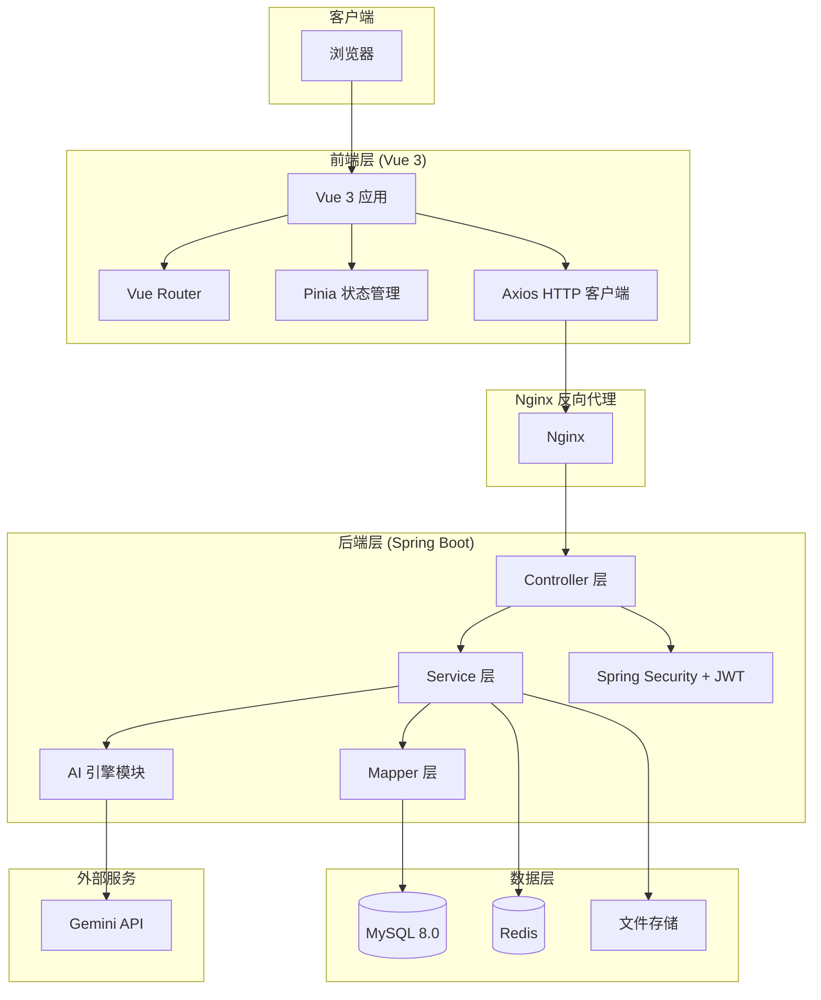
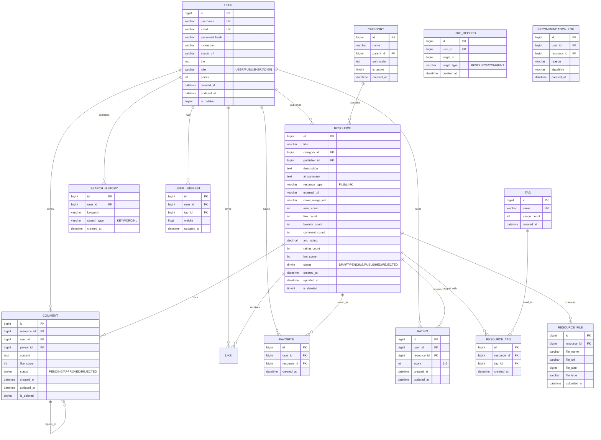

# AI 个性化学习资源分享平台 - 系统设计文档

## 1. 系统架构设计

### 1.1 技术栈选型

| 层级 | 技术选型 | 选型理由 |
|------|---------|---------|
| **前端框架** | Vue 3 + TypeScript | 组合式 API 更灵活，TypeScript 提供类型安全 |
| **UI 框架** | Tailwind CSS | 原子化 CSS，快速构建响应式界面 |
| **状态管理** | Pinia | Vue 3 官方推荐，轻量级，支持 TypeScript |
| **HTTP 客户端** | Axios | 拦截器机制便于统一处理 Token 和错误 |
| **路由** | Vue Router 4 | Vue 3 官方路由，支持动态路由和路由守卫 |
| **后端框架** | Spring Boot 3 | Java 生态成熟，自动配置简化开发 |
| **ORM** | MyBatis-Plus | 简化 CRUD，支持分页和条件构造器 |
| **认证** | Spring Security + JWT | 无状态认证，适合前后端分离架构 |
| **缓存** | Redis | 高性能缓存，支持多种数据结构 |
| **数据库** | MySQL 8.0 | 成熟稳定，支持全文索引 |
| **文件存储** | 本地文件系统 / MinIO | 可扩展的对象存储方案 |
| **AI 对接** | Gemini API 兼容接口 | 统一 AI 调用层，支持多模型切换 |
| **构建工具** | Vite (前端) / Maven (后端) | 快速构建和热更新 |
| **API 文档** | SpringDoc OpenAPI (Swagger) | 自动生成 API 文档，支持在线调试 |

### 1.2 系统架构图



### 1.3 分层架构说明

```
┌─────────────────────────────────────────────────────────────┐
│                      前端 (Vue 3)                           │
│  ┌─────────┐  ┌─────────┐  ┌─────────┐  ┌──────────────┐  │
│  │  Pages  │  │Components│  │  Store  │  │   Router     │  │
│  └────┬────┘  └────┬────┘  └────┬────┘  └──────────────┘  │
│       └────────────┼────────────┘                          │
│                    │                                        │
│              ┌─────▼─────┐                                 │
│              │  Services  │ (API 调用层)                    │
│              └─────┬─────┘                                 │
└────────────────────┼───────────────────────────────────────┘
                     │ HTTP/REST
┌────────────────────┼───────────────────────────────────────┐
│              ┌─────▼─────┐                                 │
│              │Controller │ (接收请求，参数校验)              │
│              └─────┬─────┘                                 │
│              ┌─────▼─────┐                                 │
│              │  Service   │ (业务逻辑处理)                  │
│              └─────┬─────┘                                 │
│         ┌─────────┼─────────┐                              │
│    ┌────▼────┐ ┌──▼──┐ ┌───▼────┐                         │
│    │ Mapper  │ │Redis│ │AI Engine│                         │
│    └────┬────┘ └─────┘ └───┬────┘                         │
└─────────┼──────────────────┼───────────────────────────────┘
     ┌────▼────┐         ┌───▼────┐
     │ MySQL   │         │Gemini  │
     └─────────┘         └────────┘
```

## 2. 数据库设计

### 2.1 ER 图



### 2.2 核心表说明

#### 用户表 (user)
存储用户基本信息和角色权限。`role` 字段控制 RBAC 权限，`points` 字段记录用户积分。

#### 资源表 (resource)
核心业务表，存储资源元信息。`ai_summary` 存储 AI 生成的摘要。`hot_score` 综合点赞、收藏、评分、浏览量计算热度分。`status` 控制资源审核状态。

#### 标签-资源关联表 (resource_tag)
多对多关联，支持一个资源多个标签，一个标签关联多个资源。

#### 评论表 (comment)
支持多级评论，`parent_id` 为 NULL 表示一级评论，否则为回复。

#### 点赞表 (like_record)
通用点赞表，通过 `target_type` 区分点赞资源还是评论。

### 2.3 索引设计

```sql
-- 用户表索引
CREATE UNIQUE INDEX idx_user_username ON user(username);
CREATE UNIQUE INDEX idx_user_email ON user(email);

-- 资源表索引
CREATE INDEX idx_resource_category ON resource(category_id);
CREATE INDEX idx_resource_publisher ON resource(publisher_id);
CREATE INDEX idx_resource_status ON resource(status);
CREATE INDEX idx_resource_hot_score ON resource(hot_score DESC);
CREATE INDEX idx_resource_created ON resource(created_at DESC);
CREATE FULLTEXT INDEX ft_resource_title_desc ON resource(title, description);

-- 标签关联表索引
CREATE INDEX idx_rt_resource ON resource_tag(resource_id);
CREATE INDEX idx_rt_tag ON resource_tag(tag_id);
CREATE UNIQUE INDEX idx_rt_unique ON resource_tag(resource_id, tag_id);

-- 评论表索引
CREATE INDEX idx_comment_resource ON comment(resource_id);
CREATE INDEX idx_comment_user ON comment(user_id);
CREATE INDEX idx_comment_parent ON comment(parent_id);

-- 点赞表索引
CREATE UNIQUE INDEX idx_like_unique ON like_record(user_id, target_id, target_type);
CREATE INDEX idx_like_target ON like_record(target_id, target_type);

-- 收藏表索引
CREATE UNIQUE INDEX idx_fav_unique ON favorite(user_id, resource_id);

-- 评分表索引
CREATE UNIQUE INDEX idx_rating_unique ON rating(user_id, resource_id);
CREATE INDEX idx_rating_resource ON rating(resource_id);

-- 搜索历史索引
CREATE INDEX idx_search_user ON search_history(user_id);
CREATE INDEX idx_search_created ON search_history(created_at DESC);

-- 用户兴趣索引
CREATE UNIQUE INDEX idx_interest_unique ON user_interest(user_id, tag_id);
CREATE INDEX idx_interest_user ON user_interest(user_id);
```

## 3. RESTful API 设计

### 3.1 API 规范

- 基础路径：`/api/v1`
- 认证方式：Bearer Token (JWT)
- 请求/响应格式：JSON
- 分页参数：`page` (页码，从1开始), `size` (每页条数，默认10)
- 响应格式：

```json
{
  "code": 200,
  "message": "success",
  "data": { ... }
}
```

分页响应格式：
```json
{
  "code": 200,
  "message": "success",
  "data": {
    "records": [...],
    "total": 100,
    "page": 1,
    "size": 10,
    "pages": 10
  }
}
```

### 3.2 接口列表

#### 3.2.1 认证模块

| Method | Path | 描述 | 认证 |
|--------|------|------|------|
| POST | `/api/v1/auth/register` | 用户注册 | 否 |
| POST | `/api/v1/auth/login` | 用户登录 | 否 |
| POST | `/api/v1/auth/refresh` | 刷新 Token | 是 |
| POST | `/api/v1/auth/logout` | 退出登录 | 是 |
| GET | `/api/v1/auth/me` | 获取当前用户信息 | 是 |

**POST /api/v1/auth/register**
```json
// Request
{
  "username": "string (3-20字符)",
  "email": "string (邮箱格式)",
  "password": "string (6-20字符)",
  "nickname": "string (可选)"
}

// Response 201
{
  "code": 201,
  "message": "注册成功",
  "data": {
    "id": 1,
    "username": "testuser",
    "nickname": "测试用户",
    "role": "USER",
    "token": "eyJhbGciOiJIUzI1NiIs...",
    "expiresIn": 86400
  }
}
```

**POST /api/v1/auth/login**
```json
// Request
{
  "username": "string",
  "password": "string"
}

// Response 200
{
  "code": 200,
  "message": "登录成功",
  "data": {
    "id": 1,
    "username": "testuser",
    "nickname": "测试用户",
    "avatar": "https://...",
    "role": "USER",
    "token": "eyJhbGciOiJIUzI1NiIs...",
    "refreshToken": "eyJhbGciOiJIUzI1NiIs...",
    "expiresIn": 86400
  }
}
```

#### 3.2.2 用户模块

| Method | Path | 描述 | 认证 |
|--------|------|------|------|
| GET | `/api/v1/users/{id}` | 获取用户公开信息 | 否 |
| PUT | `/api/v1/users/profile` | 更新个人信息 | 是 |
| PUT | `/api/v1/users/avatar` | 更新头像 | 是 |
| PUT | `/api/v1/users/password` | 修改密码 | 是 |
| GET | `/api/v1/users/{id}/resources` | 获取用户发布的资源 | 否 |
| GET | `/api/v1/users/favorites` | 获取我的收藏 | 是 |
| GET | `/api/v1/users/statistics` | 获取用户统计数据 | 是 |

**PUT /api/v1/users/profile**
```json
// Request
{
  "nickname": "string",
  "bio": "string (最多200字)",
  "email": "string"
}

// Response 200
{
  "code": 200,
  "message": "更新成功",
  "data": { ... }
}
```

#### 3.2.3 资源模块

| Method | Path | 描述 | 认证 |
|--------|------|------|------|
| GET | `/api/v1/resources` | 获取资源列表（分页+筛选） | 否 |
| GET | `/api/v1/resources/{id}` | 获取资源详情 | 否 |
| POST | `/api/v1/resources` | 发布资源 | 是(PUBLISHER+) |
| PUT | `/api/v1/resources/{id}` | 更新资源 | 是(所有者/管理员) |
| DELETE | `/api/v1/resources/{id}` | 删除资源 | 是(所有者/管理员) |
| POST | `/api/v1/resources/{id}/files` | 上传资源文件 | 是(所有者) |
| GET | `/api/v1/resources/hot` | 获取热门资源 | 否 |
| GET | `/api/v1/resources/latest` | 获取最新资源 | 否 |

**GET /api/v1/resources**
```json
// Query Parameters
// ?page=1&size=10&keyword=Java&categoryId=1&tags=并发,多线程
//    &sortBy=hot&minRating=4&startDate=2024-01-01&endDate=2024-12-31

// Response 200
{
  "code": 200,
  "message": "success",
  "data": {
    "records": [
      {
        "id": 1,
        "title": "Java并发编程实战笔记",
        "category": { "id": 1, "name": "计算机科学" },
        "tags": [
          { "id": 1, "name": "Java" },
          { "id": 2, "name": "并发" }
        ],
        "publisher": {
          "id": 1,
          "nickname": "张三",
          "avatar": "https://..."
        },
        "aiSummary": "本笔记详细讲解了Java并发编程的核心概念...",
        "coverImage": "https://...",
        "viewCount": 1200,
        "likeCount": 89,
        "favoriteCount": 45,
        "avgRating": 4.5,
        "ratingCount": 30,
        "hotScore": 856,
        "createdAt": "2024-03-15T10:30:00"
      }
    ],
    "total": 100,
    "page": 1,
    "size": 10,
    "pages": 10
  }
}
```

**POST /api/v1/resources**
```json
// Request (multipart/form-data)
{
  "title": "string (必填)",
  "categoryId": "long (必填)",
  "tags": ["string", "string"] ,
  "description": "string (必填，支持Markdown)",
  "resourceType": "FILE | LINK",
  "externalUrl": "string (resourceType=LINK时必填)",
  "files": [File] (resourceType=FILE时必填)
}

// Response 201
{
  "code": 201,
  "message": "资源发布成功",
  "data": {
    "id": 1,
    "title": "Java并发编程实战笔记",
    "status": "PUBLIShED",
    "aiSummary": "本笔记详细讲解了Java并发编程的核心概念..."
  }
}
```

#### 3.2.4 分类模块

| Method | Path | 描述 | 认证 |
|--------|------|------|------|
| GET | `/api/v1/categories` | 获取分类树 | 否 |
| GET | `/api/v1/categories/{id}` | 获取分类详情 | 否 |
| POST | `/api/v1/categories` | 创建分类 | 是(管理员) |
| PUT | `/api/v1/categories/{id}` | 更新分类 | 是(管理员) |
| DELETE | `/api/v1/categories/{id}` | 删除分类 | 是(管理员) |

#### 3.2.5 标签模块

| Method | Path | 描述 | 认证 |
|--------|------|------|------|
| GET | `/api/v1/tags` | 获取标签列表 | 否 |
| GET | `/api/v1/tags/hot` | 获取热门标签 | 否 |
| GET | `/api/v1/tags/search` | 搜索标签（自动补全） | 否 |
| POST | `/api/v1/tags` | 创建标签 | 是 |
| DELETE | `/api/v1/tags/{id}` | 删除标签 | 是(管理员) |

#### 3.2.6 搜索模块

| Method | Path | 描述 | 认证 |
|--------|------|------|------|
| GET | `/api/v1/search` | 关键词搜索 | 否 |
| POST | `/api/v1/search/nl` | 自然语言搜索 (NL2API) | 是 |
| GET | `/api/v1/search/history` | 获取搜索历史 | 是 |
| DELETE | `/api/v1/search/history` | 清空搜索历史 | 是 |
| GET | `/api/v1/search/hot` | 获取热门搜索词 | 否 |

**POST /api/v1/search/nl**
```json
// Request
{
  "query": "推荐关于Java并发编程且评分最高的前5个资源"
}

// Response 200
{
  "code": 200,
  "message": "success",
  "data": {
    "parsedIntent": {
      "keywords": ["Java", "并发编程"],
      "sortBy": "rating",
      "limit": 5,
      "filters": {}
    },
    "results": [
      {
        "id": 1,
        "title": "Java并发编程实战笔记",
        "aiSummary": "...",
        "avgRating": 4.8,
        "matchReason": "包含Java并发相关内容，评分4.8"
      }
    ]
  }
}
```

#### 3.2.7 AI 模块

| Method | Path | 描述 | 认证 |
|--------|------|------|------|
| POST | `/api/v1/ai/summary` | 生成资源摘要 | 是(PUBLISHER+) |
| GET | `/api/v1/ai/recommendations` | 获取个性化推荐 | 是 |
| POST | `/api/v1/ai/recommendations/reasons` | 获取推荐理由 | 是 |

**GET /api/v1/ai/recommendations**
```json
// Query Parameters
// ?page=1&size=10

// Response 200
{
  "code": 200,
  "message": "success",
  "data": {
    "records": [
      {
        "resource": {
          "id": 1,
          "title": "Java并发编程实战笔记",
          "aiSummary": "...",
          "avgRating": 4.5
        },
        "recommendReason": "因为你最近在看多线程相关资料，这份笔记的锁机制讲解很适合你",
        "algorithm": "TAG_BASED",
        "score": 0.92
      }
    ],
    "total": 20,
    "page": 1,
    "size": 10
  }
}
```

#### 3.2.8 互动模块

| Method | Path | 描述 | 认证 |
|--------|------|------|------|
| POST | `/api/v1/resources/{id}/like` | 点赞/取消点赞资源 | 是 |
| POST | `/api/v1/resources/{id}/favorite` | 收藏/取消收藏资源 | 是 |
| POST | `/api/v1/resources/{id}/rating` | 评分资源 | 是 |
| GET | `/api/v1/resources/{id}/comments` | 获取资源评论列表 | 否 |
| POST | `/api/v1/resources/{id}/comments` | 发表评论 | 是 |
| DELETE | `/api/v1/comments/{id}` | 删除评论 | 是(所有者/管理员) |
| POST | `/api/v1/comments/{id}/like` | 点赞/取消点赞评论 | 是 |

**POST /api/v1/resources/{id}/like**
```json
// Response 200 (点赞)
{
  "code": 200,
  "message": "点赞成功",
  "data": {
    "liked": true,
    "likeCount": 90
  }
}

// Response 200 (取消点赞)
{
  "code": 200,
  "message": "取消点赞",
  "data": {
    "liked": false,
    "likeCount": 89
  }
}
```

**POST /api/v1/resources/{id}/rating**
```json
// Request
{
  "score": 5
}

// Response 200
{
  "code": 200,
  "message": "评分成功",
  "data": {
    "myRating": 5,
    "avgRating": 4.6,
    "ratingCount": 31
  }
}
```

**POST /api/v1/resources/{id}/comments**
```json
// Request
{
  "content": "这份笔记写得很详细，特别是锁机制那部分！",
  "parentId": null  // null为一级评论，填写评论ID为回复
}

// Response 201
{
  "code": 201,
  "message": "评论成功",
  "data": {
    "id": 1,
    "content": "这份笔记写得很详细，特别是锁机制那部分！",
    "user": {
      "id": 1,
      "nickname": "张三",
      "avatar": "https://..."
    },
    "parentId": null,
    "likeCount": 0,
    "createdAt": "2024-03-15T10:30:00"
  }
}
```

#### 3.2.9 管理员模块

| Method | Path | 描述 | 认证 |
|--------|------|------|------|
| GET | `/api/v1/admin/users` | 用户列表（分页） | 是(管理员) |
| PUT | `/api/v1/admin/users/{id}/role` | 修改用户角色 | 是(管理员) |
| PUT | `/api/v1/admin/users/{id}/status` | 启用/禁用用户 | 是(管理员) |
| GET | `/api/v1/admin/resources/pending` | 待审核资源列表 | 是(管理员) |
| PUT | `/api/v1/admin/resources/{id}/audit` | 审核资源 | 是(管理员) |
| GET | `/api/v1/admin/statistics` | 平台统计数据 | 是(管理员) |

**PUT /api/v1/admin/resources/{id}/audit**
```json
// Request
{
  "action": "APPROVE | REJECT",
  "reason": "string (拒绝时必填)"
}

// Response 200
{
  "code": 200,
  "message": "审核完成",
  "data": {
    "id": 1,
    "status": "PUBLISHED"
  }
}
```

### 3.3 错误码定义

| 错误码 | HTTP 状态 | 描述 |
|--------|----------|------|
| 200 | 200 | 成功 |
| 201 | 201 | 创建成功 |
| 400 | 400 | 请求参数错误 |
| 401 | 401 | 未认证 / Token 过期 |
| 403 | 403 | 无权限 |
| 404 | 404 | 资源不存在 |
| 409 | 409 | 冲突（如重复点赞） |
| 422 | 422 | 业务逻辑错误 |
| 429 | 429 | 请求过于频繁 |
| 500 | 500 | 服务器内部错误 |
| 503 | 503 | AI 服务不可用 |

## 4. 前端页面设计

### 4.1 页面结构

```
├── 首页 (/)
│   ├── 顶部导航栏 (Logo, 搜索框, 用户菜单)
│   ├── 分类导航
│   ├── AI 推荐区域
│   ├── 热门资源
│   └── 最新资源
│
├── 搜索结果页 (/search)
│   ├── 搜索栏 (支持自然语言)
│   ├── 筛选面板 (分类, 标签, 评分, 时间)
│   ├── 排序选项
│   └── 结果列表
│
├── 资源详情页 (/resource/:id)
│   ├── 资源信息 (标题, 分类, 标签)
│   ├── AI 摘要展示
│   ├── 详细描述 (Markdown 渲染)
│   ├── 操作栏 (点赞, 收藏, 评分)
│   ├── 文件下载 / 链接跳转
│   ├── 评论区
│   └── 相关推荐
│
├── 发布资源页 (/publish)
│   ├── 表单 (标题, 分类, 标签, 描述)
│   ├── 文件上传 / 链接输入
│   └── 预览 & 提交
│
├── 个人中心 (/profile)
│   ├── 个人信息
│   ├── 我的收藏
│   ├── 我的发布
│   └── 学习统计
│
└── 管理后台 (/admin)
    ├── 仪表盘 (统计数据)
    ├── 用户管理
    ├── 资源审核
    ├── 分类管理
    └── 标签管理
```

### 4.2 设计规范

#### 色彩系统
- 主色：#3B82F6 (Blue-500) - 信任、专业
- 成功色：#10B981 (Emerald-500)
- 警告色：#F59E0B (Amber-500)
- 错误色：#EF4444 (Red-500)
- 背景色：#F8FAFC (Slate-50)
- 文本色：#1E293B (Slate-800)

#### 字体系统
- 正文：Inter / 系统默认字体
- 代码：JetBrains Mono
- 中文：思源黑体 / 系统默认

#### 间距系统
- 基础单位：4px
- 常用间距：8, 12, 16, 20, 24, 32, 48px

#### 响应式断点
- sm: 640px
- md: 768px
- lg: 1024px
- xl: 1280px
- 2xl: 1536px
