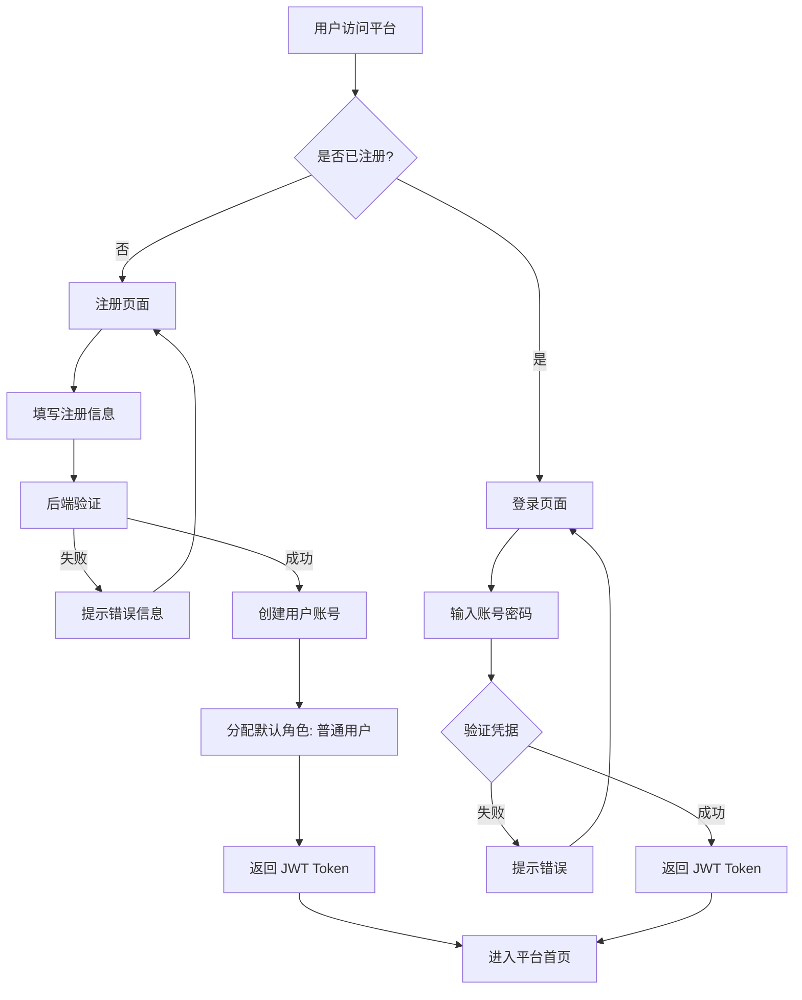
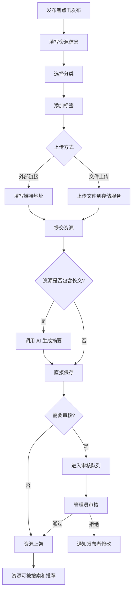
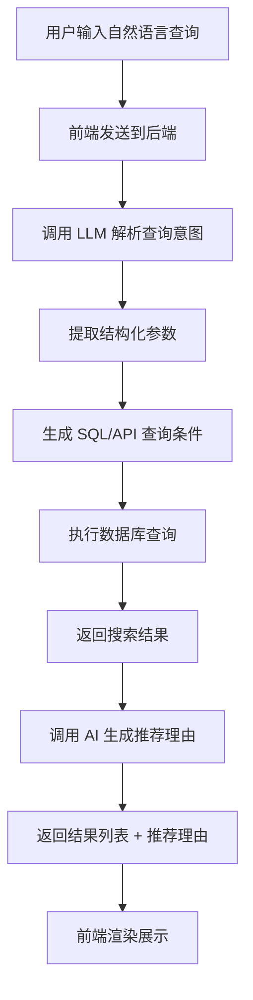
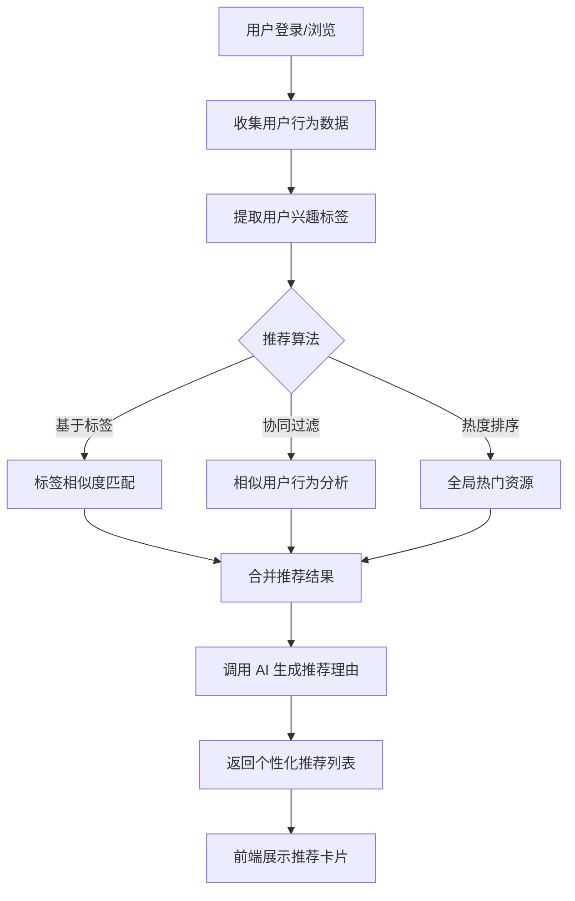
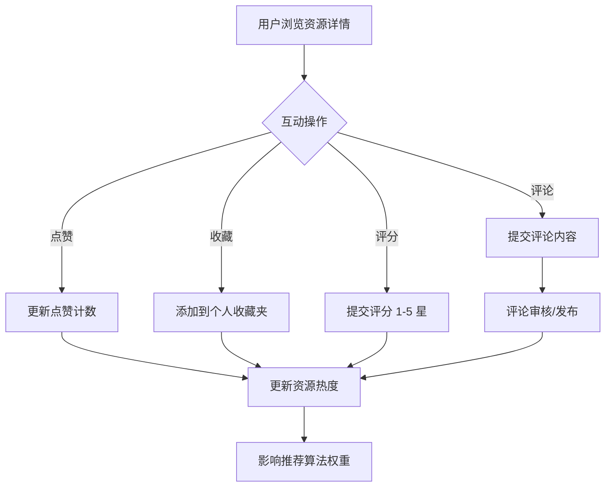

# AI 个性化学习资源分享平台 - 产品需求文档 (PRD)

## 1. 产品背景

### 1.1 市场痛点
大学生在学习过程中积累了大量优质笔记、视频教程、电子书等学习资源，但缺乏一个统一的平台进行分享和发现。现有平台存在以下问题：
- 资源分散在各个渠道，难以系统化检索
- 缺乏个性化推荐，用户难以发现符合自身需求的资源
- 资源质量参差不齐，缺乏有效的评价和筛选机制
- 长文/大文件缺少智能摘要，用户需要花费大量时间预览

### 1.2 产品定位
构建一个面向大学生的学习资源共享社区，利用 AI 技术实现智能推荐、自然语言搜索和自动摘要，提升学习资源的发现效率和使用体验。

### 1.3 核心价值主张
- **智能发现**：AI 驱动的个性化推荐，让每个用户都能找到最适合自己的学习资源
- **自然交互**：支持自然语言搜索，降低检索门槛
- **高效预览**：AI 自动生成精准摘要，快速判断资源价值
- **社区共建**：点赞、收藏、评分、评论，构建良性学习社区生态

## 2. 用户画像

### 2.1 核心用户群体

| 用户角色 | 描述 | 核心需求 | 使用场景 |
|---------|------|---------|---------|
| **普通用户** (学习者) | 在校大学生，需要查找学习资料 | 快速找到高质量学习资源、获取个性化推荐 | 课前预习、课后复习、考前冲刺 |
| **资源发布者** (贡献者) | 乐于分享学习成果的学生 | 便捷发布资源、获得认可和反馈 | 整理笔记后上传、分享学习心得 |
| **管理员** | 平台运营人员 | 维护平台秩序、审核内容质量 | 审核新资源、处理违规内容、管理标签 |

### 2.2 用户旅程地图

```
学习者典型旅程：
需求产生 → 搜索/浏览 → AI推荐 → 预览摘要 → 查看详情 → 下载/收藏 → 评分/评论
```

## 3. 核心业务流程

### 3.1 用户注册与认证流程



### 3.2 资源发布流程



### 3.3 AI 智能搜索流程



### 3.4 个性化推荐流程



### 3.5 社区互动流程



## 4. 功能详情说明

### 4.1 用户与权限管理

#### 4.1.1 用户注册/登录
- 支持用户名 + 密码注册
- 邮箱验证（可选）
- JWT Token 认证机制
- Token 自动刷新机制

#### 4.1.2 角色权限 (RBAC)

| 功能 | 普通用户 | 资源发布者 | 管理员 |
|------|---------|-----------|--------|
| 浏览资源 | ✅ | ✅ | ✅ |
| 搜索/筛选 | ✅ | ✅ | ✅ |
| 点赞/收藏 | ✅ | ✅ | ✅ |
| 评分/评论 | ✅ | ✅ | ✅ |
| 发布资源 | ❌ | ✅ | ✅ |
| 管理个人资源 | ❌ | ✅ | ✅ |
| 用户管理 | ❌ | ❌ | ✅ |
| 资源审核 | ❌ | ❌ | ✅ |
| 标签管理 | ❌ | ❌ | ✅ |
| 系统配置 | ❌ | ❌ | ✅ |

#### 4.1.3 个人中心
- 个人信息编辑
- 头像上传
- 我的收藏列表
- 我的发布列表
- 学习历史记录

### 4.2 资源管理

#### 4.2.1 资源发布
- 标题（必填，最多 100 字符）
- 分类（单选，预设分类树）
- 标签（多选，支持自定义，最多 10 个）
- 详细描述（富文本，支持 Markdown）
- 资源类型：文件上传 / 外部链接
- 支持的文件格式：PDF、DOCX、PPT、MP4、ZIP 等
- 文件大小限制：单文件最大 500MB

#### 4.2.2 资源展示
- 列表视图（卡片/紧凑两种模式）
- 详情页（标题、描述、AI 摘要、标签、评分、评论）
- 相关资源推荐

#### 4.2.3 资源分类体系
```
├── 计算机科学
│   ├── 编程语言 (Java, Python, C++, Go...)
│   ├── 数据结构与算法
│   ├── 操作系统
│   ├── 计算机网络
│   ├── 数据库
│   └── 人工智能/机器学习
├── 数学
│   ├── 高等数学
│   ├── 线性代数
│   ├── 概率论与数理统计
│   └── 离散数学
├── 语言学习
│   ├── 英语
│   ├── 日语
│   └── 其他语种
├── 专业课
│   ├── 经济学
│   ├── 管理学
│   ├── 法学
│   └── ...
└── 考试资料
    ├── 考研
    ├── 四六级
    ├── 计算机等级考试
    └── ...
```

### 4.3 搜索与筛选

#### 4.3.1 搜索功能
- 关键词全文检索（基于 MySQL FULLTEXT）
- 搜索历史记录
- 热门搜索推荐
- 搜索结果排序（相关度、最新、最热、评分最高）

#### 4.3.2 筛选条件
- 分类筛选（单选）
- 标签筛选（多选，AND/OR 逻辑）
- 评分范围筛选
- 时间范围筛选
- 资源类型筛选

### 4.4 AI 增强功能

#### 4.4.1 AI 智能摘要
- **触发时机**：资源发布时，若描述超过 500 字或上传文件
- **处理逻辑**：调用 LLM API，生成约 100 字的精准摘要
- **存储方式**：摘要随资源一起存储，避免重复调用
- **展示位置**：资源卡片和详情页

#### 4.4.2 自然语言搜索 (NL2API)
- **输入示例**："推荐关于 Java 并发编程且评分最高的前 5 个资源"
- **处理流程**：
  1. 接收自然语言输入
  2. 调用 LLM 解析为结构化查询参数
  3. 提取：关键词、分类、标签、排序方式、数量限制
  4. 执行结构化查询
  5. 返回结果
- **输出格式**：标准搜索结果 + AI 解析的查询意图展示

#### 4.4.3 个性化推荐
- **推荐算法**：
  - 基于标签的内容推荐（权重 40%）
  - 基于用户行为的协同过滤（权重 40%）
  - 全局热度推荐（权重 20%）
- **推荐理由生成**：调用 AI 根据用户兴趣和资源特点生成个性化推荐理由
- **推荐场景**：
  - 首页推荐流
  - 资源详情页"相关推荐"
  - 个人中心"猜你喜欢"

### 4.5 社区互动

#### 4.5.1 点赞
- 一键点赞/取消点赞
- 实时更新点赞计数
- 点赞影响资源热度

#### 4.5.2 收藏
- 添加到默认收藏夹
- 支持创建自定义收藏夹
- 收藏夹公开/私密设置

#### 4.5.3 评分
- 1-5 星评分
- 显示平均评分和评分分布
- 评分影响搜索排序和推荐权重

#### 4.5.4 评论
- 支持一级评论和回复（二级）
- 评论排序（最新、最热）
- 评论内容审核（敏感词过滤）
- 支持 Markdown 格式

## 5. 非功能需求

### 5.1 性能要求
- 页面首屏加载时间 < 2s
- 搜索响应时间 < 500ms
- AI 摘要生成时间 < 5s
- 支持 1000 并发用户

### 5.2 安全要求
- JWT Token 有效期控制
- 密码加密存储（BCrypt）
- SQL 注入防护
- XSS 防护
- 文件上传类型和大小限制
- 敏感词过滤

### 5.3 可用性要求
- 移动端响应式适配
- 无障碍访问支持（WCAG 2.1 AA）
- 多浏览器兼容（Chrome、Firefox、Safari、Edge）

## 6. 技术约束

- 前端：Vue 3 + TypeScript + Tailwind CSS
- 后端：Spring Boot (Java)
- 数据库：MySQL + Redis
- AI 对接：Spring AI (阿里云百炼 Qwen, DashScope OpenAI 兼容 API)
- 部署环境：Windows (PowerShell 7)
